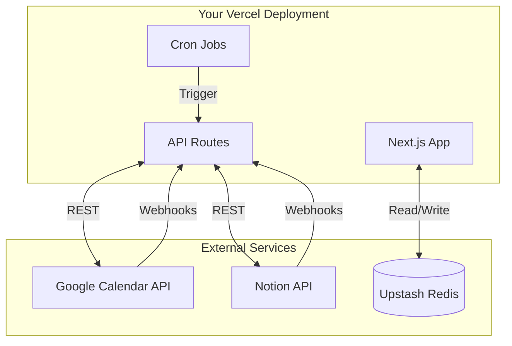
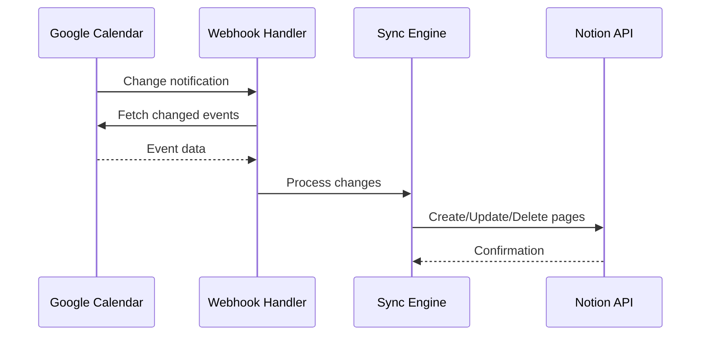
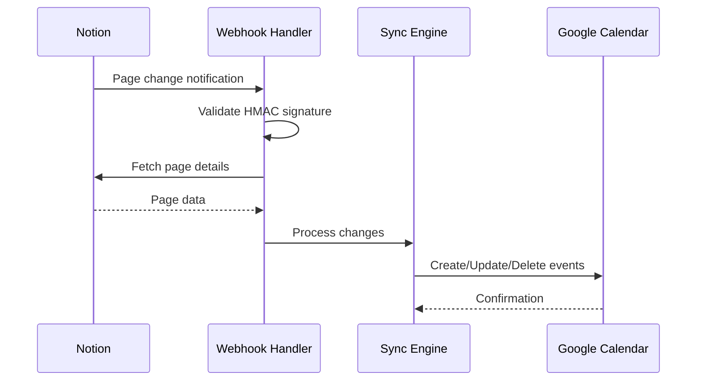
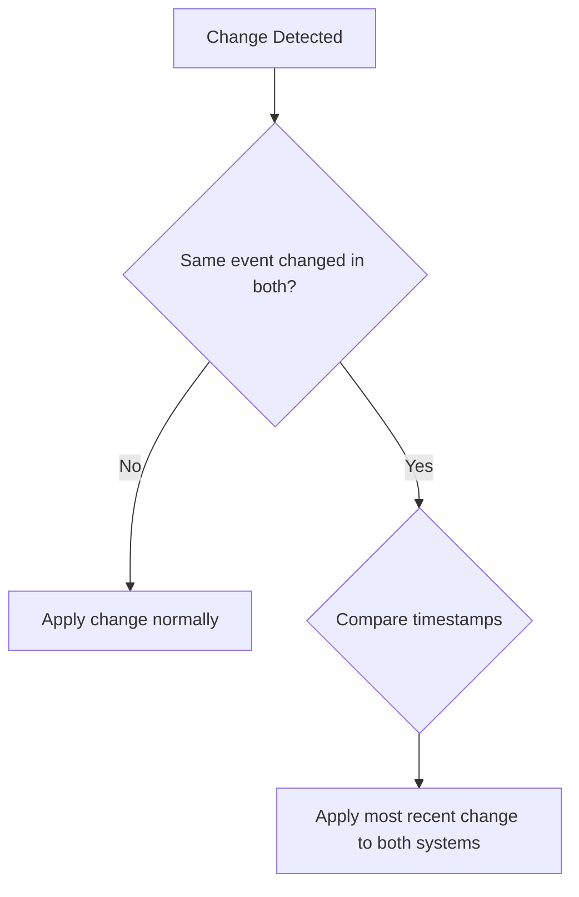
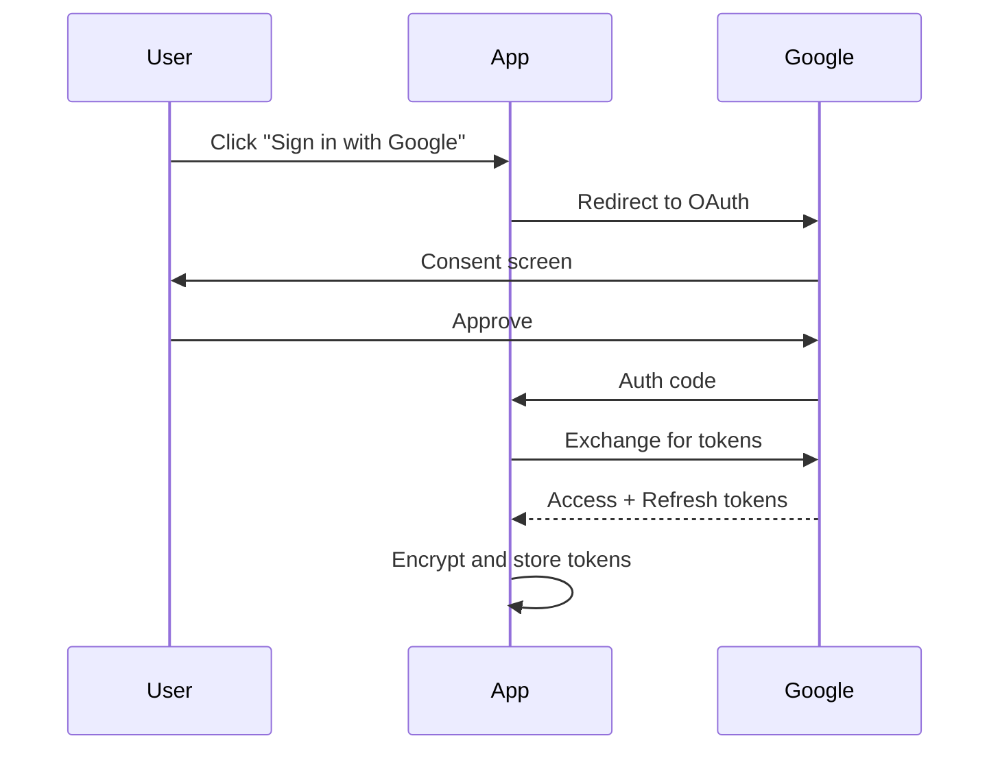
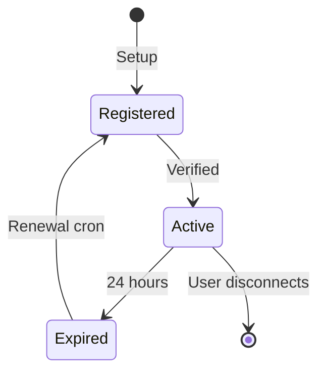

This document explains the technical architecture of the While sync.

## System Diagram



## Components

### Next.js Application

The app is built with Next.js App Router and runs on Vercel's serverless infrastructure.

| Component | Purpose |
|-----------|---------|
| Dashboard | Monitor sync status and view logs |
| Setup Wizard | Guide users through initial configuration |
| Settings | Manage connections and field mappings |
| API Routes | Handle sync operations and webhooks |

### API Routes

Server-side endpoints that handle webhooks, scheduled sync jobs, and app configuration.

| Route | Method | Purpose |
|-------|--------|---------|
| `/api/webhooks/google-calendar` | POST | Receive Google Calendar change notifications |
| `/api/webhooks/notion` | POST | Receive Notion webhook notifications |
| `/api/cron/sync-notion` | GET | Daily fallback sync (catches missed webhooks) |
| `/api/cron/renew-webhook` | GET | Renew Google Calendar webhooks |
| `/api/setup/*` | Various | Setup wizard endpoints |
| `/api/settings/*` | Various | Settings management |

### Redis Storage

Upstash Redis stores application state with encryption.

| Key Pattern | Purpose |
|-------------|---------|
| `settings:{userId}` | Encrypted credentials and configuration |
| `sync:state:{userId}` | Current sync state and cursors |
| `sync:logs:{userId}` | Recent sync operation logs |

## Sync Flow

### Google Calendar → Notion



**Timing:** Near real-time (seconds)

1. Google sends webhook when calendar changes
2. App fetches changed events from Google
3. Sync engine processes each change
4. Corresponding Notion pages are updated

### Notion → Google Calendar



**Timing:** Near real-time (seconds)

1. Notion sends webhook when page changes (created/updated/deleted)
2. App validates HMAC signature
3. App fetches page details from Notion
4. Sync engine processes changes
5. Corresponding Google Calendar events are updated

### Cron Job

A daily cron job runs as fallback to catch any missed webhooks. This is highly unlikely—Notion webhooks are reliable—but the cron ensures data consistency if network issues or transient failures occur.

## Conflict Resolution

When the same event is modified in both systems:

1. **Most Recent Wins**: The change with the later timestamp takes precedence
2. **Field-Level Merging**: Each field is compared independently
3. **Deletion Priority**: If either system deletes an event, it's deleted in both



## Security

### Credential Storage

All sensitive credentials are encrypted before storage:

```
Credentials → AES-256-GCM Encryption → Upstash Redis
```

| What's Encrypted | Encryption |
|------------------|------------|
| Google OAuth tokens | AES-256-GCM |
| Notion API token | AES-256-GCM |
| Field mappings | Plaintext (no secrets) |

### Authentication Flow



## Webhooks

### Google Calendar Webhooks

Google Calendar webhooks require:
1. HTTPS endpoint (Vercel provides this)
2. Domain verification (handled automatically)
3. Periodic renewal (see below)

**Why renewal is required:** Google Calendar webhooks expire after a maximum of 7 days (typically ~24 hours in practice). Unlike Notion webhooks which persist indefinitely, Google requires you to re-register webhook channels before they expire. If a webhook expires, you stop receiving change notifications entirely—missing all calendar updates until the next manual sync.

**Renewal strategy:** A daily cron job checks if the webhook expires within 6 hours. If so, it:
1. Stops the old webhook channel
2. Registers a new one with Google
3. Saves the new channel metadata to Redis

The 6-hour buffer ensures renewal happens well before actual expiration, accounting for:
- Cron timing variance (Vercel cron can be delayed)
- Transient API failures with retry time
- Timezone edge cases

**Lifecycle:**



### Notion Webhooks

Notion webhooks require:
1. HTTPS endpoint (Vercel provides this)
2. Manual verification in Notion UI
3. HMAC-SHA256 signature validation

**Event types handled:**

| Event | Action |
|-------|--------|
| `page.created` | New page synced to GCal |
| `page.content_updated` | Content changes synced |
| `page.properties_updated` | Property changes synced |
| `page.deleted` | Corresponding GCal event deleted |

## Cron Jobs

Defined in `vercel.json`:

```json
{
  "crons": [
    {
      "path": "/api/cron/sync-notion",
      "schedule": "0 3 * * *"
    },
    {
      "path": "/api/cron/renew-webhook",
      "schedule": "0 12 * * *"
    }
  ]
}
```

| Job | Schedule | Purpose |
|-----|----------|---------|
| `sync-notion` | Daily 3 AM | Fallback sync (catches missed webhooks) |
| `renew-webhook` | Daily 12 PM | Renew Google Calendar webhook (if expires within 6 hours) |

## Error Handling

### Retry Strategy

Failed sync operations are retried with exponential backoff:

| Attempt | Delay |
|---------|-------|
| 1 | Immediate |
| 2 | 1 second |
| 3 | 2 seconds |
| 4 | 4 seconds |
| 5 | 8 seconds |

After 5 failures, the operation is logged and skipped.

### Rate Limiting

Both APIs have rate limits:

| API | Limit | Handling |
|-----|-------|----------|
| Google Calendar | 1M queries/day | Queue and batch |
| Notion | 3 req/sec | Delay between requests |

## Scaling Considerations

The current architecture is designed for personal use (1-2 calendars):

| Metric | Supported |
|--------|-----------|
| Events | Thousands |
| Sync frequency | Real-time (webhooks) |
| Concurrent users | 1 per deployment |

For multiple calendars, deploy separate instances.
