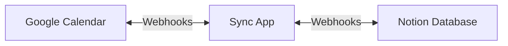

import { Cards, Card } from "fumadocs-ui/components/card";
import { FAQAccordion, FAQAccordionItem } from "@/components/mdx/faq-accordion";

# While

A self-hosted, open-source solution for bidirectional synchronization between Notion and Google Calendar.

<Cards>
  <Card title="Quickstart" href="/docs/quickstart">
    Get up and running in 5 minutes
  </Card>
  <Card title="Architecture" href="/docs/architecture">
    Learn how the sync works
  </Card>
</Cards>

## Why This Project?

Managing events across both Notion and Google Calendar often means:
- Double-entering events manually
- Forgetting to update one system when changes happen
- Losing track of what's accurate

This sync eliminates all of that by keeping both systems perfectly in sync.

## Key Features

<FAQAccordion>
  <FAQAccordionItem title="Bidirectional Sync">
    Changes made in either Notion or Google Calendar are automatically synced to the other.
    Edit in whichever app you prefer - both stay current.
  </FAQAccordionItem>
  <FAQAccordionItem title="Real-time Updates">
    Both Google Calendar and Notion changes are captured via webhooks for instant updates.
    A daily fallback sync ensures nothing is missed.
  </FAQAccordionItem>
  <FAQAccordionItem title="Self-Hosted & Private">
    Deploy to your own Vercel account. Your credentials are encrypted and stored in your own Redis instance.
    No data passes through third-party servers.
  </FAQAccordionItem>
  <FAQAccordionItem title="Custom Field Mapping">
    Map any Notion property to Google Calendar fields.
    Full control over how your data syncs between systems.
  </FAQAccordionItem>
</FAQAccordion>

## How It Works

1. **Google → Notion**: Webhooks capture changes instantly
2. **Notion → Google**: Webhooks capture changes instantly
3. **Fallback Sync**: Daily cron catches any missed webhooks
4. **Conflict Resolution**: Most recent change wins

## Requirements

- A [Vercel](https://vercel.com) account (free tier works)
- A [Google](https://calendar.google.com) account with Google Calendar
- A [Notion](https://notion.so) account with a calendar database

## Getting Help

<Cards>
  <Card title="Troubleshooting" href="/docs/guides/troubleshooting">
    Common issues and solutions
  </Card>
  <Card title="GitHub Issues" href="https://github.com/mcsdevv/while/issues">
    Report bugs or request features
  </Card>
</Cards>
